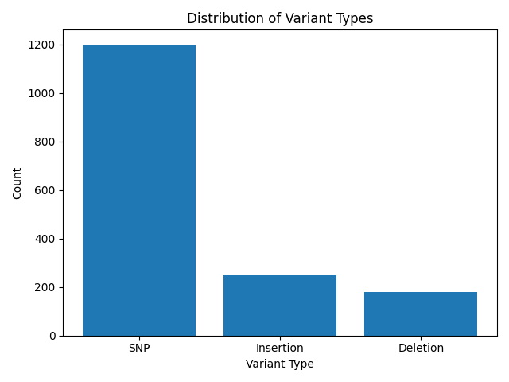
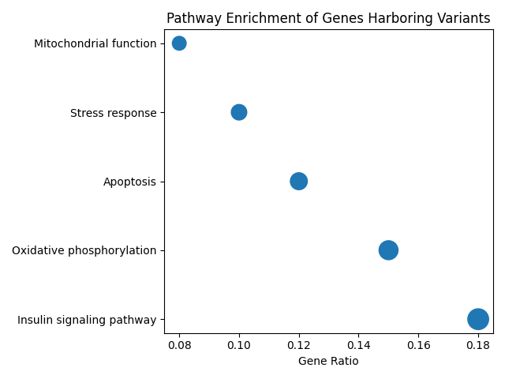

# 🧬 Variant Calling Analysis in Bovine Embryos with Differential Cryotolerance

This repository presents a genomic variant analysis pipeline developed during my Master's research, focusing on the identification and functional interpretation of genetic variants associated with cryotolerance in bovine embryos.

---

## 🔬 Biological Background

Cryotolerance is a key factor influencing the success of bovine embryo cryopreservation in assisted reproduction programs. Genetic variation affecting transcriptionally active genes may influence cellular mechanisms such as stress response, membrane integrity, mitochondrial activity, and energy metabolism, ultimately impacting embryo survival after freezing and thawing.

This project investigates genetic variants associated with **high** and **low cryotolerance phenotypes** in bovine embryos and explores the biological pathways potentially impacted by genes harboring these variants.

---

## 🧪 Experimental Design

RNA-seq data were obtained from bovine embryos classified into two phenotypic groups:

| Phenotype | Description |
|---------|-------------|
| High Cryotolerance | Embryos with high post-thaw survival |
| Low Cryotolerance | Embryos with low post-thaw survival |

Variants were identified from RNA-seq alignments and compared between groups to highlight candidate genes and pathways associated with cryotolerance.

---

## ⚙️ Bioinformatics Workflow

### 1️⃣ RNA-seq Alignment and Variant Calling (Linux)

Variant discovery was performed in a Linux environment and included:

- Splice-aware alignment of RNA-seq reads to the *Bos taurus* reference genome using **HISAT2**
- Conversion, sorting, and indexing of alignment files using **SAMtools**
- Variant calling from aligned RNA-seq data using **bcftools**
- Generation of VCF files containing variants located in expressed genomic regions

---

### 2️⃣ Variant Annotation and Gene Mapping

Identified variants were processed and mapped to genes, allowing the identification of genes harboring variants potentially associated with cryotolerance phenotypes.

---

### 3️⃣ Functional Enrichment Analysis (R)

Genes containing variants were subjected to functional enrichment analysis in **R**, including:

- Gene Ontology (GO) enrichment analysis
- Pathway enrichment analysis (KEGG)
- Visualization of enriched biological processes and pathways

---

## 📊 Data Visualization

The project includes visual summaries such as:

- Distribution of variants across genes
- Summary statistics of variant types
- Functional enrichment dot plots
- Pathway-level visualizations highlighting biological mechanisms related to cryotolerance

All generated figures are available in the `figures/` directory.

---

## ⚠️ RNA-seq–Based Variant Calling Considerations

Variant calling in this project was performed using RNA-seq data rather than whole-genome sequencing. As a result:

- Detected variants represent **transcriptionally active regions**
- Coverage varies according to gene expression levels
- Splice-aware alignment is essential for accurate variant detection
- Results are interpreted as functionally relevant expressed variants

This approach is appropriate for exploring variants with potential biological impact on embryo cryotolerance while acknowledging methodological limitations.

---

## 📊 Data Visualization

### Variant Type Distribution
Summary of variant classes identified from RNA-seq–based variant calling.

### Functional Enrichment of Variant-Associated Genes
Pathway enrichment analysis of genes harboring genetic variants highlights biological processes potentially associated with embryo cryotolerance.

## 🔐 Data Availability and Reproducibility

Due to data confidentiality, the datasets provided in this repository are **simulated** or derived from representative structures of the original data. All scripts and parameters faithfully reproduce the original analytical workflow.

---

## 🛠️ Tools and Software Used

### Linux / Command Line
- **HISAT2**
- **SAMtools**
- **bcftools**

### R / Statistical Analysis
- **R**
- **VariantAnnotation**
- **clusterProfiler**
- **org.Bt.eg.db**
- **ggplot2**
- **biomaRt**

### Databases
- *Bos taurus* reference genome
- Gene Ontology (GO)
- KEGG Pathway Database

---

## 📌 Key Takeaways

This project demonstrates:

- Variant calling from RNA-seq data using splice-aware alignment
- Integration of variant discovery with functional pathway analysis
- Application of genomics to reproductive and developmental biology
- Reproducible and well-documented bioinformatics workflows

---

## 👩‍🔬 Author

Biologist (B.Sc., UFSCar), currently pursuing a Master’s degree, with experience in bioinformatics, RNA-seq analysis, variant calling, functional genomics, and biostatistics.
